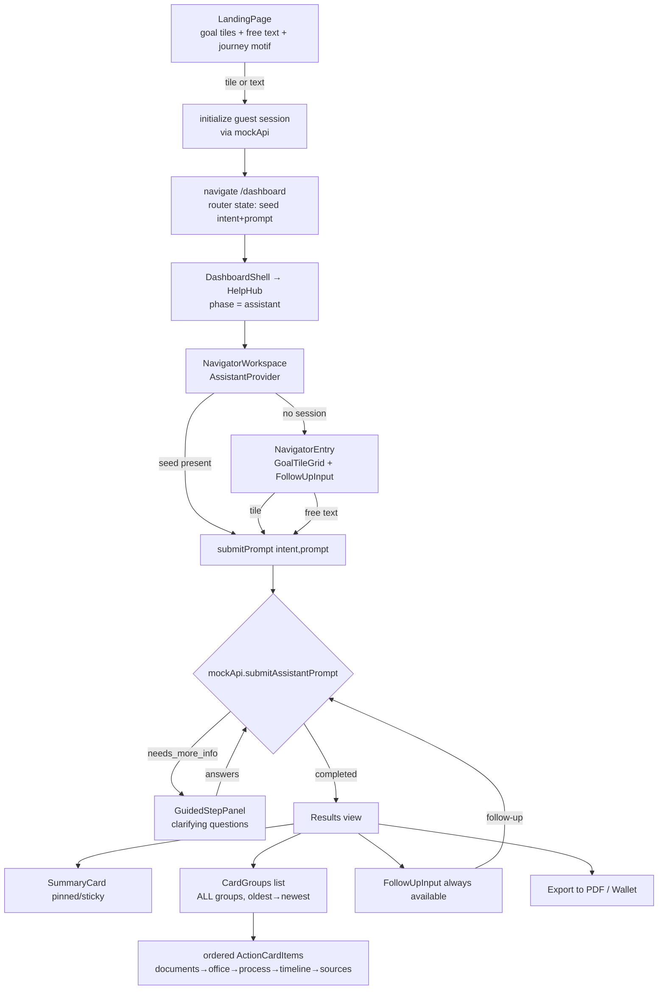

# Design Document

## Overview

The Guided Navigator Revamp evolves the existing **Action Workspace** (`AssistantWorkspace` + `AssistantProvider`/`useAssistantSession` + `mockApi` + `assistantMock`) into a **Navigator** — a goal-first, anti-chatbot guidance experience. Rather than forking a parallel feature, we extend the data and component layers that already exist so the moving parts (sessions, `cardGroups`, guided questions, wallet, EN/DE locale, mock-API persistence) keep working and the diff stays small enough for a hackathon.

The revamp delivers seven user-visible changes:

1. **Goal-first entry** — a grid of tappable goal tiles presented co-equally with an always-available free-text field, on both the Landing page and the Navigator's starting view.
2. **Summary-first output** — every result begins with a distinct `Summary_Card` (situation recap + single most important next step + urgency) that stays visible while the user scrolls.
3. **Fixed action-card ordering** — documents → where to go → process → timeline → sources.
4. **Actionable vs. advisable classification** — every action card is labelled and visually distinguished as a step the user must do versus advice worth knowing.
5. **Office information** — a dedicated `Office_Card` (Ausländerbehörde/Bürgeramt, booking portal steps, what to bring, city-aware text).
6. **Reliable follow-up** — render *all* card groups (fixing the current "last group only" bug) and keep intent continuity across follow-ups.
7. **PDF export** — replace the current `.txt`/`.json` exports with a client-side jsPDF generator.

An optional enhancement (Requirement 14) adds step-completion tracking persisted through the mock API.

Two design decisions frame the whole effort and are justified in [Design Decisions and Rationale](#design-decisions-and-rationale): **(a) use jsPDF for client-side PDF**, and **(b) evolve the existing workspace rather than fork a new feature**.

### Scope and Constraints

- **Client-only.** No backend. All persistence flows through `apiService` in `src/services/mockApi.js`; no module outside it touches `localStorage` (Req 10).
- **Guest mode only.** Personalized mode stays disabled.
- **i18n preserved.** All new UI chrome is keyed through `useLocale`. Mock card *content* (the German bureaucratic copy in `assistantMock.js`) is currently English-only literals; see [Internationalization](#internationalization-strategy) for the scope decision.
- **Accessibility preserved.** New controls follow the existing conventions (real `<button>`s, `focus-visible` rings, `aria-live`, `sr-only` labels) already used in `MapNode`, `GuidedStepPanel`, etc.

## Architecture

### Current vs. Target

The current flow routes the user **Landing → ChooseHelpMode → (Guided Interview | Action Workspace)**. The target flow makes the Navigator the primary experience and demotes the mode chooser.



### Component Tree (target)

```
DashboardShell (GuidedInterviewProvider)
└─ HelpHub  (phase switch)
   ├─ ChooseHelpMode            … kept but no longer the default landing target
   ├─ GuidedInterviewFlow       … unchanged
   ├─ InterviewResults          … unchanged
   └─ NavigatorWorkspace        … evolved from AssistantWorkspace (AssistantProvider)
      ├─ NavigatorEntry (no active session)
      │  ├─ GoalTileGrid → GoalTile[]      (NEW)
      │  └─ FollowUpInput                  (reused; co-equal free-text path)
      └─ Results (active session)
         ├─ SessionHeader                  (reused)
         ├─ SummaryCard                    (NEW — pinned/sticky)
         ├─ GuidedStepPanel                (reused — clarifying questions)
         ├─ CardGroupList                  (NEW — iterates ALL cardGroups)
         │  └─ ActionCardGrid              (reused; now ordered + classified)
         │     └─ ActionCardItem           (extended: classification label, completion)
         ├─ WalletToolbar / WalletPanel    (reused; PDF export wired in)
         └─ FollowUpInput                  (reused; always available)
```

### Data Flow

1. **Entry.** A goal tile carries a deterministic `intent`; free text is classified by `detectIntent`. Both produce a `seed = { prompt, intent? }` and call `submitPrompt`.
2. **Persistence.** `useAssistantSession.submitPrompt` → `apiService.submitAssistantPrompt({ prompt, sessionId, intent })` → `simulateAssistantResponse({ prompt, intent, answers, followUpPrompts })`. The mock decides `needs_more_info` (push `guidedState`) or `completed` (push a new `cardGroup`), persists the whole session, returns it.
3. **Render.** The provider exposes `activeSession`, **all** `cardGroups` (replacing the single `currentCardGroup`), a derived `summary`, `walletItems`, and guided state. The workspace renders the pinned `SummaryCard`, the ordered/classified card groups, and the always-available follow-up input.
4. **Export.** Wallet/PDF actions read structured `cardGroup`/`walletBundle` data and generate a PDF entirely on the client.

All reads/writes remain behind `apiService`; UI state that is purely transient (router navigation `seed`, expanded-card id, wallet-open toggle) is *not* persisted and does not touch `localStorage`.

## Components and Interfaces

### New Components

#### `GoalTile`
Renders one tappable goal as an accessible `<button>` (role/name exposed, Enter/Space activation, `focus-visible` ring, ≥44×44px tap target).
- **Props:** `{ tile: GoalTileDef, onSelect: (tile) => void, disabled?: boolean }`
- **Responsibilities:** display localized label/description and icon (via `AssistantIcon`); call `onSelect(tile)` on click/Enter/Space. Label sourced from locale with default-locale fallback (Req 2.6, 6.x).

#### `GoalTileGrid`
Lays out 3–8 `GoalTile`s in a responsive grid that fits the initial viewport without scrolling alongside the free-text field (Req 1.1, 5.1).
- **Props:** `{ tiles: GoalTileDef[], onSelect, disabled?, errorMessage? }`
- **Responsibilities:** grid layout; render an inline error region (`role="alert"`) when a selection fails or has no mapped intent (Req 1.6, 5.8); Tab order matches visual order (Req 11.5).

#### `NavigatorEntry`
The Navigator's starting view shown when there is no active session. Composes `GoalTileGrid` and a co-equal `FollowUpInput`, neither visually demoted (Req 1.2, 2.x, 5.2). Replaces `AssistantEmptyState` as the default empty view (the old component may be retired or kept as a fallback).
- **Props:** `{ onStart: (seed: { prompt, intent? }) => void, loading, error }`
- **Responsibilities:** map a tile selection to `{ prompt: tile.seedPrompt, intent: tile.intent }`; map a free-text submit to `{ prompt }` (no intent → classified); enforce the 1–1000 char bound before submit (Req 2.3, 2.5).

#### `SummaryCard`
A distinct, pinned (sticky) first card derived from session-level state — **not** an `ActionCardItem` and not part of `cardGroup.cards` (Req 3.1, 3.5, 1.7, 6.3).
- **Props:** `{ summary: SummaryCardModel }`
- **Responsibilities:** render the situation recap (selected goal + each answered question/answer), the emphasized primary call-to-action verdict ("do this next"), and an urgency indicator conveyed via **text + color** with `aria-live="polite"` so urgency changes are announced (Req 3.2–3.4, 11.6, 11.7). Uses a status style distinct from `ready`/`recommended`/`needs-info`. Renders an "no situation information yet" message when empty (Req 3.7).

#### `CardGroupList`
Iterates **all** `activeSession.cardGroups` in ascending `createdAt` order and renders each as a visually bounded group via `ActionCardGrid` (Req 1.4, 6.1, 6.2). This fixes the current bug where only the last group renders.
- **Props:** `{ cardGroups, onAddToWallet, isCardInWallet, completion, onToggleComplete }`
- **Responsibilities:** for each group, order its action cards by category before rendering; show each group's `intro`/follow-up prompt as a separator.

### Changed Components

#### `NavigatorWorkspace` (was `AssistantWorkspace`)
- Renders `NavigatorEntry` when there is no session; otherwise renders the pinned `SummaryCard` + `CardGroupList` + always-available `FollowUpInput`.
- On mount, reads a one-time router `seed` from `location.state` and calls `submitPrompt(seed.prompt, { intent: seed.intent })` if no active session exists.
- The "Back to help options" affordance is retained but de-emphasized.

#### `ActionCardItem`
- Reads new `card.classification` (`actionable` | `advisable`) and renders a **text label** ("Action needed" / "Good to know") plus visual distinction, independent of color (Req 12.1–12.3).
- `advisable` maps to the existing `recommended` status style; available `actionable` → `ready`; `actionable` lacking info → `needs-info` (Req 12.5).
- When completion tracking is enabled and the card is `actionable`, renders a completion control (checkbox-style `<button>` with `aria-pressed`) and a completed text state (Req 14.1, 14.2).

#### `useAssistantSession` (provider)
- Replace `currentCardGroup` (last-only) with `cardGroups` (full, sorted) plus a derived `summary` (from `buildSummaryCard`).
- Add `submitPrompt(prompt, { intent } = {})` passing the optional intent through to the API.
- Add completion helpers: `cardCompletion`, `toggleCardCompletion(cardGroupId, cardId)`, `completionProgress`.
- Keep `error` surfacing for failed prompts/follow-ups (Req 6.5) and wallet/PDF/completion failures (Req 8.6, 14.6).

#### `LandingPage`
- Replace the two `ModeCard`s with a **goal-first hero**: `GoalTileGrid` (3–8 tiles) + co-equal `FollowUpInput`, plus a **journey motif** showing Arrival → Registration → Permit → Work in order, reusing the `MapNode`/`TopicMap` visual idea as a simple horizontal stepper.
- Preserve the existing trust strip (`landing.trust.*`) verbatim (Req 5.5).
- Tile/text activation: `initialize({ restartHelp: true })` → set help phase to `assistant` → `navigate('/dashboard', { state: { seed } })` within 1s (Req 5.6, 5.7). Invalid/unmapped tile → stay on landing, show error (Req 5.8).
- All text via locale; re-renders on locale change (Req 5.9, 5.10).

#### `mockApi` / `assistantMock` / `walletExport`
Covered in [Data-Layer Changes](#data-layer-changes) and [PDF Export Design](#pdf-export-design).

## Data Models

### Session schema additions (STORAGE_VERSION 4 → 5)

Per-assistant-session object (`session.assistant.sessions[]`) gains two fields:

```js
{
  // …existing: id, title, createdAt, updatedAt, originalPrompt,
  //            followUpPrompts[], cardGroups[], guidedAnswers{}, guidedState, status
  intent: 'residence' | 'anmeldung' | 'work' | 'general' | null, // NEW — established intent (Req 7.4)
  cardCompletion: {                                              // NEW — Req 14 (optional)
    // key: `${cardGroupId}:${cardId}` → boolean
  },
}
```

`STORAGE_VERSION` bumps to `5`. `migrateSession` is extended to **preserve existing data** while back-filling the new fields, instead of resetting on any mismatch:

- If `schemaVersion < 5` but the session is otherwise well-formed, upgrade in place: ensure `assistant`, `wallet`, set `schemaVersion = 5`, and for each assistant session default `intent ??= null` and `cardCompletion ??= {}`.
- A hard reset remains the fallback only when the stored blob is unpar'seable or structurally invalid.

This avoids wiping a guest's in-progress data purely because of the field addition (supports Req 10.4).

### `GoalTileDef` and `GOAL_TILES`

New exported data in `assistantMock.js` (or a new `src/data/navigatorGoals.js`):

```js
// GoalTileDef
{
  id: string,            // stable key, e.g. 'first_residence'
  intent: 'residence' | 'anmeldung' | 'work' | 'general',
  icon: string,          // ASSISTANT_ICON_MAP key, e.g. 'FileText'
  labelKey: string,      // locale key, e.g. 'goals.firstResidence.label'
  descriptionKey: string,
  seedPrompt: string,    // canonical prompt used to start the session
}
```

`GOAL_TILES` (6 tiles, satisfies Req 2.1 minimum of first-residence / register-address / renew, and the 3–8 range of Req 1.1/5.1):

| id | intent | seed prompt (intent-anchored) |
|----|--------|-------------------------------|
| `first_residence` | `residence` | "How do I get my first residence permit?" |
| `register_address` | `anmeldung` | "How do I register my address (Anmeldung)?" |
| `renew_permit` | `residence` | "How do I renew my residence permit?" |
| `work` | `work` | "Can I work with my current permit?" |
| `change_status` | `residence` | "How do I change my residence status?" |
| `something_else` | `general` | "I need help with something else" |

Because tiles carry an explicit `intent`, tile activation **never** invokes free-text classification (Req 2.2); the `seedPrompt` only seeds the recap text and matches `detectIntent` as a safety net.

### Action card model extensions

Each card object gains two fields (defaults applied by the builders so existing rendering keeps working):

```js
{
  id, title, description, icon, status, content,   // existing
  category: 'documents' | 'office' | 'process' | 'timeline' | 'sources' | 'other', // NEW
  classification: 'actionable' | 'advisable',      // NEW (Req 12)
}
```

**Category ordering** is enforced by a pure helper `orderActionCards(cards)` that sorts by a fixed rank `documents < office < process < timeline < sources < other`, omitting absent categories while preserving the relative order of the rest (Req 3.6). `eligibility`-type guidance maps to `other`/`advisable`.

**Classification → status** mapping rendered by `ActionCardItem`:
- `advisable` → `recommended` style + "Good to know" label.
- `actionable` & has everything needed → `ready` + "Action needed".
- `actionable` & missing info → `needs-info` + "Action needed".

### `SummaryCardModel`

Produced by a pure `buildSummaryCard({ goalLabel, intent, answers, cards })`:

```js
{
  kind: 'summary',
  empty: boolean,                 // true when no goal and no answers (Req 3.7)
  goalLabel: string | null,       // selected goal text
  answeredQuestions: [ { question, answerLabel } ],   // mirrors resolveAnsweredQuestions
  verdict: {                      // the single most important next action (Req 3.3, 12.4)
    text: string,                 // e.g. "Book your Ausländerbehörde appointment now"
    fromCardId: string | null,    // the top actionable card it was derived from
  },
  urgency: {
    level: 'none' | 'soon' | 'urgent',
    label: string,                // localized text label (Req 11.6)
    detail: string | null,        // e.g. deadline date / remaining window (Req 3.4)
    colorToken: string,           // tailwind token; never the sole signal
  },
}
```

The verdict is chosen as the **first `actionable` card** in canonical order (documents/office/process), falling back to a generic "review your steps" message when no actionable card exists. Urgency derives from existing signals such as `answers.permit_expiry` (`expired`/`30_days` → `urgent`; `3_months` → `soon`; else `none`) and the Anmeldung 14-day rule.

### `OfficeCardContent`

The `Office_Card` (`category: 'office'`, `classification: 'actionable'`) carries:

```js
content: {
  officeType: string | null,      // 'Ausländerbehörde' | 'Bürgeramt' | null (Req 4.1, 4.2)
  officeFallback: string | null,  // shown when officeType is null
  bookingPortal: {
    name: string,                 // portal name (Req 4.3)
    steps: string[],              // ordered navigation steps to reach booking page
    cityText: string | null,      // includes exact user city when provided (Req 4.5), else null (Req 4.6)
  },
  whatToBring: string[],          // ≥1 entry (Req 4.4)
  sources: [ { label, url } ],
}
```

Office-type mapping: `residence → 'Ausländerbehörde'`, `anmeldung → 'Bürgeramt'`, otherwise `null` (render fallback message but still show booking + what-to-bring sections, Req 4.2). City comes from the existing `city` guided answer.

### Locale keys (new namespaces)

- `navigator.*` — workspace chrome (entry title/subtitle, results hints).
- `goals.*` — tile labels/descriptions (`goals.firstResidence.label`, etc.).
- `summary.*` — verdict prefix, urgency labels (`summary.urgency.urgent/soon/none`), empty message.
- `office.*` — office-type names, booking-portal labels, what-to-bring header, fallback text.
- `classification.*` — `actionable` / `advisable` labels.
- `completion.*` — mark-complete control, completed state, progress (`completion.progress` with `{{done}}/{{total}}`).
- `export.*` — PDF button labels, PDF section headings, error message.
- `landing.journey.*` — Arrival / Registration / Permit / Work stage labels; `landing.goalsTitle`, `landing.freeTextLabel`.

Every key gets EN and DE entries; `useLocale` already falls back EN → key (Req 9.5, 9.6) and defaults to DE (Req 9.7).

## Data-Layer Changes

### `assistantMock.js`

1. **`simulateAssistantResponse({ prompt, intent, answers, followUpPrompts })`** — accept an optional `intent` override; when absent, fall back to `detectIntent(prompt)` (preserves current behavior). This lets goal tiles and intent continuity drive the topic deterministically.
2. **Card builders** (`buildResidenceCards`, `buildAnmeldungCards`, `buildGeneralCards`) — tag every card with `category` and `classification`, and add an **`office` card** to residence and anmeldung outputs with `OfficeCardContent` (office type, booking portal steps, what-to-bring, city-aware text/fallback).
3. **`orderActionCards(cards)`** — new pure export enforcing the fixed category order.
4. **`buildSummaryCard(...)`** — new pure export producing `SummaryCardModel`.
5. **`GOAL_TILES`** — new export (data above).
6. `simulateAssistantResponse` continues to return `cards` (now ordered + classified); summary is derived separately so it can be pinned across multiple groups.

### `mockApi.js`

1. **`STORAGE_VERSION = 5`** and a **non-destructive `migrateSession`** that back-fills `intent` and `cardCompletion`.
2. **`submitAssistantPrompt({ prompt, sessionId, intent })`** — intent-continuity logic:
   - New session: `activeSession.intent = intent ?? detectIntent(prompt)`.
   - Follow-up: `detected = intent ?? detectIntent(prompt)`; if `detected !== 'general' && detected !== activeSession.intent` then `activeSession.intent = detected`; else keep the established intent (Req 7.1–7.5).
   - Call `simulateAssistantResponse({ prompt, intent: activeSession.intent, answers, followUpPrompts })`.
   - Continue to **append** the new `cardGroup` (never replace) — already correct (Req 6.4) — and persist.
3. **`submitGuidedAnswer`** — pass `activeSession.intent` into the simulate call so clarifying answers stay on topic.
4. **`setCardCompletion({ sessionId, cardGroupId, cardId, completed })`** — new method writing `activeSession.cardCompletion[`${cardGroupId}:${cardId}`] = completed`, persisting and returning the session; surfaces a thrown error on persist failure (Req 14.3, 14.6, 10.5).
5. Wallet methods (`addCardToWallet`, `addSessionToWallet`) currently read only the **last** card group; they will accept an explicit `cardGroupId` so any visible group's cards can be saved.

## PDF Export Design

Replace the `.txt`/`.json` exporters in `src/utils/walletExport.js` with a jsPDF-based generator. jsPDF is added as a runtime dependency (`package.json`).

**API surface (single, focused):**

```js
// walletExport.js
export function buildExportModel(item)              // pure: → { title, contextSummary, cards[] }
export async function downloadWalletItemAsPdf(item) // single card or session item → .pdf
export async function downloadWalletBundleAsPdf(bundle) // walletBundle → .pdf
```

**Content order (Req 8.2):** context summary → cards → steps → sources. Implementation:

1. `buildExportModel` (pure, unit/property-testable) normalizes a wallet item or bundle into an ordered structure: the context summary (selected goal text + each answered question paired with its answer, Req 8.4) followed by **every** action card in guide order (Req 8.5), each with body → steps → checklist items → sources.
2. A thin `renderPdf(model)` walks the model, writing lines with a `y`-cursor and calling `doc.addPage()` when the cursor passes the page bottom (manual pagination keeps it dependency-light and handles up to 50 cards well within 10s, Req 8.1).
3. `doc.save(filename)` where `filename` ends in `.pdf` (Req 8.3), slugged from the title + date (reusing the existing slug logic).
4. Wrap generation in `try/catch`; on failure surface an error to the caller and leave the saved state untouched (Req 8.6). `formatCardContent`/`formatContextSummary` are refactored to emit line arrays that both the (now-removed) text path and the PDF renderer can consume — maximizing reuse of already-correct structuring code.

`downloadTextFile`, `downloadWalletItemsAsJson`, and the `.txt` formatter are removed; `WalletPanel`/`WalletToolbar` are rewired to the PDF functions.

## Internationalization Strategy

- **UI chrome** introduced by this revamp (tiles, summary labels, urgency labels, office headers, classification labels, completion, export, landing journey) is **fully keyed** in `en.json`/`de.json` (Req 9.1–9.4).
- **Mock card content** (the bureaucratic body text inside `assistantMock.js`) is presently English-only string literals and is *not* user-configurable product copy. **Recommendation:** for hackathon scope, key the UI chrome now and leave mock card *content* in English (clearly noted as mock data); keying the mock content is an optional follow-up. This keeps the demo honest about the i18n boundary without ballooning the locale files. The Office_Card's structural labels (office-type name, "what to bring", booking steps header) **are** keyed since they are chrome the user reads as part of the new feature.

## Correctness Properties

*A property is a characteristic or behavior that should hold true across all valid executions of a system — essentially, a formal statement about what the system should do. Properties serve as the bridge between human-readable specifications and machine-verifiable correctness guarantees.*

These properties target the **pure logic** introduced by this revamp (intent detection/continuity, goal mapping, card ordering/classification, summary and office content, the PDF export model, session migration, and locale fallback). UI layout, sticky positioning, focus order, and visual styling are verified by component/manual tests instead (see Testing Strategy). Each property is intended to be implemented as a single property-based test with ≥100 iterations.

### Property 1: detectIntent is total and falls back to general

*For any* string of length 1–1000, `detectIntent` returns exactly one of the defined intents `{residence, anmeldung, work, general}`, and *for any* string containing none of the topic keywords it returns `general`, with `buildGeneralCards()` producing at least one card.

**Validates: Requirements 2.3, 2.4**

### Property 2: Goal-tile mapping is deterministic and well-formed

*For any* tile in `GOAL_TILES`, the tile maps deterministically (without invoking free-text classification) to `tile.intent`, repeated mapping is identical, every `tile.intent` is one of the defined intents, and the required goals (first residence permit, register address, renew permit) are present.

**Validates: Requirements 1.5, 2.1, 2.2, 5.6**

### Property 3: Free-text length validation

*For any* string, the entry validator accepts it iff its trimmed length is within the allowed bound (1–1000 for submission; the field caps at 500 visible chars), and rejects empty or over-length input without invoking classification or mutating state.

**Validates: Requirements 1.3, 2.5**

### Property 4: Action cards are ordered and fully preserved

*For any* list of action cards with categories, `orderActionCards` returns a permutation containing every input card exactly once (none omitted regardless of classification), in which the present categories appear in the fixed rank documents → office → process → timeline → sources → other, preserving relative order within equal ranks.

**Validates: Requirements 3.6, 12.6**

### Property 5: Every action card is classified

*For any* card set produced by the builders, every card has a `classification` of `actionable` or `advisable` and a defined `category`.

**Validates: Requirements 12.1**

### Property 6: Classification maps to the correct status

*For any* card, the classification-to-status mapping yields `recommended` for `advisable`, `ready` for an `actionable` card with sufficient info, and `needs-info` for an `actionable` card lacking info; and the rendered classification label text is the expected non-empty string for each classification.

**Validates: Requirements 12.3, 12.5**

### Property 7: Summary content reflects situation

*For any* answers map and selected goal, `buildSummaryCard` produces `answeredQuestions` covering exactly the answered question ids (each paired with its answer label) and sets `goalLabel` to the selected goal; when both are absent, `empty` is true and a "no information yet" message is present.

**Validates: Requirements 3.2, 3.7, 13.2**

### Property 8: Verdict surfaces the top actionable step

*For any* card set, when at least one `actionable` card exists, `buildSummaryCard().verdict.fromCardId` identifies the first `actionable` card in canonical order; when none exists, the verdict falls back to a generic non-empty message.

**Validates: Requirements 3.3, 12.4**

### Property 9: Urgency always has a text label

*For any* urgency-bearing input (e.g. `permit_expiry` value), `buildSummaryCard().urgency.level` maps per rule (`expired`/`30_days` → urgent, `3_months` → soon, else none) and `urgency.label` is a non-empty text value distinct per level (independent of color).

**Validates: Requirements 3.4, 11.6**

### Property 10: Office-type mapping

*For any* intent, the office card's `officeType` is `Ausländerbehörde` for residence, `Bürgeramt` for anmeldung, and `null` (with a fallback message) for any other intent, while the booking-portal and what-to-bring sections are still present.

**Validates: Requirements 4.1, 4.2**

### Property 11: Office content completeness

*For any* office card, `bookingPortal.name` is non-empty, `bookingPortal.steps` has at least one ordered entry, and `whatToBring` has at least one entry with all entries distinct.

**Validates: Requirements 4.3, 4.4**

### Property 12: City inclusion and fallback

*For any* provided city value, the office card's `bookingPortal.cityText` contains that exact city string; when no city is provided, `cityText` is `null` and no empty/placeholder city reference appears.

**Validates: Requirements 4.5, 4.6**

### Property 13: Card groups are append-only and order-preserving

*For any* session with existing `cardGroups`, processing a prompt or guided answer that yields a new group results in `cardGroups` equal to the prior array followed by exactly one new group — prior entries unchanged in content, order, and count — and the rendered order is ascending by `createdAt` (oldest → newest).

**Validates: Requirements 6.1, 6.2, 6.4**

### Property 14: Intent continuity across follow-ups

*For any* session with established `intent` and *any* follow-up text: if re-detection returns `general` or the established intent, the follow-up group is generated with the established intent and `session.intent` is unchanged; if re-detection returns a defined intent different from the established one, the group is generated with that new intent and `session.intent` is replaced by it. Across any sequence of follow-ups that never detect a differing defined intent, `session.intent` remains the initial value.

**Validates: Requirements 7.1, 7.2, 7.3, 7.4, 7.5**

### Property 15: Clarifying-question gating

*For any* started session, when required situation details are missing the response status is `needs_more_info` with non-empty `guidedQuestions` and no cards, and existing `cardGroups` are left unchanged; when no required details are missing the response status is `completed` and a card group is produced.

**Validates: Requirements 6.7, 13.1, 13.3**

### Property 16: PDF export model order and completeness

*For any* wallet item or bundle, `buildExportModel` produces sections in the order context summary → cards → (within each card) body → steps → items → sources, includes the selected goal and every answered question paired with its answer, and includes every action card exactly once in the same order as the guide.

**Validates: Requirements 8.2, 8.4, 8.5**

### Property 17: PDF filename ends with .pdf

*For any* title and date, the generated filename ends with the `.pdf` extension.

**Validates: Requirements 8.3**

### Property 18: Session persistence round-trip and migration preservation

*For any* valid session, persisting it and reading it back yields a deeply equal session; and *for any* well-formed prior-version session, `migrateSession` preserves all existing data while back-filling the new `intent` and `cardCompletion` fields and setting `schemaVersion` to the current version.

**Validates: Requirements 10.4**

### Property 19: Completion round-trip

*For any* completion map written via `setCardCompletion`, reading the session back restores an identical completion map.

**Validates: Requirements 14.3, 14.4**

### Property 20: Completion progress count

*For any* card set and completion map, the progress indicator's `total` equals the number of `actionable` cards and `done` equals the number of `actionable` cards marked completed (advisable cards never counted).

**Validates: Requirements 14.5**

### Property 21: Locale fallback chain

*For any* key present only in English, `t(key)` under any active locale returns the English value; *for any* key absent in both the active locale and English, `t(key)` returns the key identifier itself.

**Validates: Requirements 9.5, 9.6**

### Property 22: Locale key parity for new keys

*For every* locale key introduced by this revamp, both the English and German locale objects contain an entry.

**Validates: Requirements 9.2**

## Error Handling

| Scenario | Handling | Requirement |
|----------|----------|-------------|
| Goal tile has no/invalid mapped intent | Stay on view, show inline `role="alert"` error, no session start | 1.6, 5.8 |
| Free text empty or >1000 chars | Reject before submit, retain view/state | 2.5 |
| Free text with no specific match | Classify as `general`, show ≥1 starting-point card | 2.4 |
| `submitAssistantPrompt` / follow-up fails | Keep prior card groups + summary unchanged, set `error`, show error indication | 6.5 |
| PDF generation fails | `try/catch`, surface error, leave saved state unchanged | 8.6 |
| `localStorage` write fails | `apiService` throws to caller; previously persisted session untouched | 10.5 |
| Completion persist fails | Retain prior persisted state, show error indication | 14.6 |
| Missing locale key | Fall back EN → key identifier | 9.5, 9.6 |
| No situation info for summary | Render Summary_Card with "no info yet" message, still first | 3.7 |
| Intent has no office mapping | Show "office could not be determined", still render other office sections | 4.2 |

Errors are surfaced through the existing `error` state in `useAssistantSession` and rendered as non-destructive inline messages, consistent with current patterns.

## Testing Strategy

**Current state:** the project has **no test framework installed** (only `oxlint`). The dependencies most amenable to automated testing are the **pure functions** in `assistantMock.js`, `walletExport.js`, `mockApi.js` (migration/continuity), and `useLocale` (fallback).

**Recommendation (hackathon-pragmatic):** add a lightweight test setup rather than leaving the new logic unverified:

- **Vitest** (integrates natively with the existing Vite 8 toolchain) as the runner.
- **fast-check** for property-based tests of the pure functions (Properties 1–22).
- **@testing-library/react** + **jsdom** for a small number of component/interaction tests (entry rendering, keyboard activation, summary pinning presence).

Add a `test` script (`vitest run`) and configure each property test to run **≥100 iterations**. If time is tight, prioritize the property tests over component tests — the pure logic is where correctness risk concentrates, and it needs no DOM.

### Dual approach

- **Property tests** (fast-check, pure functions): the 22 properties above. These are the primary safety net for intent continuity, ordering, classification, summary/office content, the PDF export model, migration, and locale fallback.
- **Unit / example tests:** concrete examples and edge cases — empty answers summary (3.7), unmapped-intent office fallback (4.2), no-city booking text (4.6), failed-follow-up state preservation (6.5), PDF generation failure (8.6), completion persist failure (14.6), skipped optional question (13.5).
- **Component / interaction tests** (RTL): goal tiles render as accessible buttons activatable by Enter/Space (11.1, 11.2), free-text and tiles both present and co-equal (1.2, 5.2), summary card rendered outside the scrolling list (1.7, 3.5), follow-up input always present (6.6), urgency region has `aria-live` (11.7).
- **Smoke / static checks:** `localStorage` referenced only inside `mockApi.js` (10.1, 10.2) via a grep-style test; guest session initializes with a generated id (10.3).
- **Integration / manual:** PDF generation for a 50-card guide completes within 10s with no network (8.1); locale toggle re-renders landing (5.10); viewport-fit of tiles without scrolling (1.1); 44×44 tap targets (5.3); focus-indicator visibility (11.4).

### Property test configuration

- Use a property-based library (fast-check) — do **not** hand-roll generators-as-loops.
- Minimum 100 iterations per property.
- Tag each property test with a comment referencing its design property, format:
  `// Feature: guided-navigator-revamp, Property {number}: {property_text}`
- Implement each correctness property with a **single** property-based test.

### Manual test checklist (demo readiness)

1. Landing shows tiles + free text + journey motif + trust strip; both EN and DE.
2. Tap a tile → lands in Navigator with a session on the mapped topic; summary first.
3. Type free text → classified session starts.
4. Residence flow asks clarifying questions, then renders summary + ordered cards incl. Office_Card.
5. Ask a follow-up ("what documents do I need?") → stays on topic, prior groups remain, new group appended, summary still pinned.
6. Switch topic mid-session via an explicit different-intent follow-up → intent switches.
7. Save to wallet → export PDF opens a `.pdf` with summary → cards → steps → sources.
8. (Optional) Mark actionable steps complete → progress updates, persists across reload.
9. Keyboard-only pass: Tab through tiles, Enter/Space activates, focus rings visible.

## Design Decisions and Rationale

### Decision 1: jsPDF for client-side PDF export

**Choice:** Add [`jsPDF`](https://github.com/parallax/jsPDF) and generate PDFs entirely in the browser, replacing the `.txt`/`.json` exporters.

**Rationale:** Requirement 8 mandates client-side-only PDF with no backend. jsPDF is the de-facto standard for browser PDF generation, has no server dependency, and its imperative text API is a clean fit for our already-structured content (we reuse `formatContextSummary`/`formatCardContent` to emit line arrays, then paginate with a `y`-cursor). Heavier HTML-to-canvas approaches (`html2pdf`, `html2canvas` + jsPDF) would couple export to DOM layout and bloat the bundle for no demo benefit. A 50-card text-based PDF renders well within the 10s budget. **Trade-off:** manual layout/pagination is more code than a print-stylesheet, but it gives deterministic, testable output (`buildExportModel` is pure) and avoids print-dialog UX.

### Decision 2: Evolve the workspace, don't fork a "Navigator" feature

**Choice:** Extend the existing `AssistantWorkspace`/`AssistantProvider`/`useAssistantSession` + `mockApi` + `assistantMock` into the Navigator, reusing `cardGroups`, the guided-question mechanism, the wallet, and the locale system. Simplify `ChooseHelpMode`/`HelpHub` so the Navigator is the primary experience reached directly from the landing page.

**Rationale:** The current code already implements ~70% of the target: sessions, card groups, guided clarifying questions, wallet persistence, and EN/DE i18n all work behind a clean mock-API boundary. A parallel feature would duplicate this surface, double the persistence/migration burden, and risk drift. The revamp's real gaps are additive — goal tiles, a derived summary slot, card ordering/classification, an office card, the all-groups render fix, intent continuity, and PDF export — each of which slots into existing extension points (a new `intent` field, two new card fields, new pure builders, a new render slot). **Trade-off:** we inherit some existing naming/shape (e.g. `guidedState`, `walletBundle`) rather than designing fresh, but keeping the proven data flow intact is the right call for a hackathon timeline and keeps the diff reviewable.

### Decision 3: Summary as a derived, pinned slot (not a card in `cardGroup.cards`)

**Choice:** Compute the `Summary_Card` from session-level state via `buildSummaryCard` and render it in a dedicated pinned/sticky slot above the card-group list, rather than prepending it into each `cardGroup.cards`.

**Rationale:** The summary must stay visible across *multiple* card groups (Req 1.7, 6.3) and recap the whole situation, not a single group. Embedding it per-group would duplicate it and complicate pinning. A derived slot keeps a single source of truth, makes sticky positioning trivial, and lets the PDF exporter reuse the same builder. **Trade-off:** the summary lives outside the `cardGroups` array, so export logic composes it explicitly — a small, well-contained cost.

### Decision 4: Non-destructive schema migration

**Choice:** Bump `STORAGE_VERSION` to 5 and upgrade well-formed older sessions in place (back-filling `intent` and `cardCompletion`) instead of resetting on any version mismatch.

**Rationale:** The current `migrateSession` wipes the session on any version change, which would destroy a guest's in-progress data on deploy. Since our additions are purely additive fields, in-place upgrade is safe and preserves the user's work (supporting Req 10.4). The hard reset remains only for genuinely unparseable/corrupt data.
